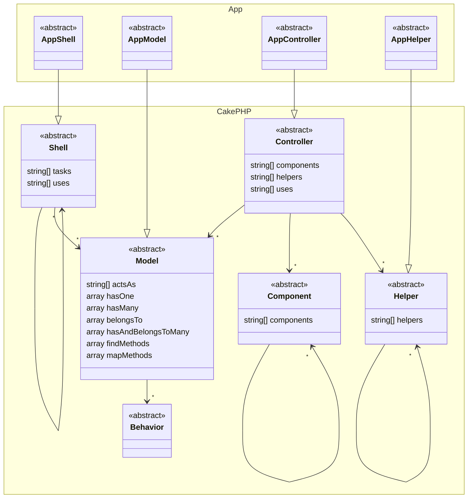

# Available Extensions

## MVC Extensions

PHPStan extensions are available for several MVC classes in CakePHP to help PHPStan understand the otherwise
undocumented methods and properties of these classes.

